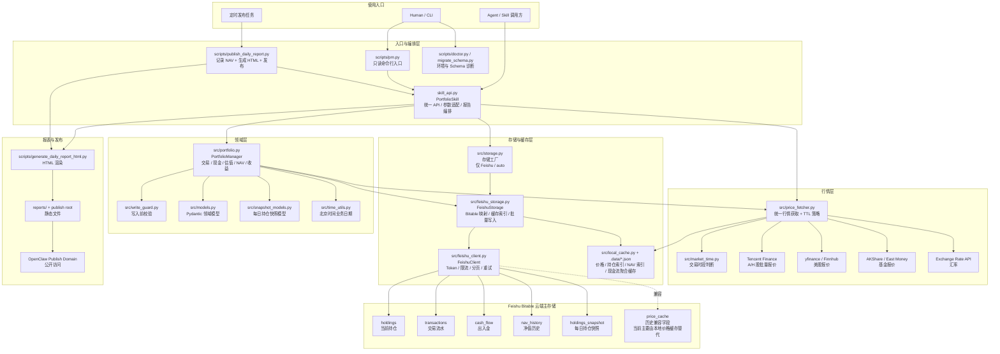

# 投资组合管理系统架构

## 架构图

查看 [`architecture.mmd`](./architecture.mmd)，可用任意 Mermaid 渲染器（VS Code 插件、GitHub、Mermaid Live Editor）打开。

---

## 架构合理性评估

### 优点

1. **职责分层清晰**
   - 入口层：`skill_api.py`、`scripts/pm.py`、`scripts/publish_daily_report.py`
   - 领域层：`PortfolioManager`、`models.py`、`write_guard.py`
   - 行情层：`PriceFetcher`、`market_time.py`
   - 存储层：`FeishuStorage`、`FeishuClient`、本地 JSON 缓存
   - 报表发布与诊断脚本独立在 `scripts/`，没有直接侵入领域模型。

2. **单一数据源 + 多端同步**
   - 以飞书 Bitable 作为云端主存储，核心表覆盖持仓、交易、现金流、净值历史、仓位快照，适合个人或小团队跨设备使用。
   - `storage.py` 明确只接受 `feishu/auto`，避免误以为 SQLite 仍可写入生产数据。

3. **缓存策略完善**
   - 本地 JSON 缓存覆盖价格、持仓索引、NAV 索引、现金流聚合。
   - `FeishuStorage` 内部还有内存缓存，可减少 Bitable 查询次数。
   - `PriceFetcher` 明确支持 cache-only、过期缓存 fallback、市场关闭 TTL 等策略。

4. **安全设计到位**
   - 写入入口有 `dry_run` / `confirm` 保护，日报发布脚本也显式区分 dry-run 与真实写入。
   - `write_guard.py` 对交易和 NAV 输入做统一校验。
   - 交易、现金流有 `request_id` / `dedup_key` 防重设计。

5. **可审计性高**
   - `holdings_snapshot` 表让每一天的 NAV 都可复现。
   - 配套 `audit_*.py`、`doctor.py`、`migrate_schema.py` 脚本，可对历史 NAV、Schema、行情行为进行巡检。

6. **时区处理正确**
   - 业务日期集中使用北京时间语义（`src/time_utils.py`），降低 UTC 跨日导致的净值日期错位风险。

---

### 风险与改进点

1. **强耦合 Feishu，无离线降级**
   - `storage.backend=auto` 实际只能解析到 Feishu；SQLite 后端已被移除。
   - 影响：Feishu API、权限、网络或 Schema 异常会直接影响主要读写路径。
   - 建议：保留最小只读快照导出，或提供本地 JSON/SQLite 只读降级，用于查看最近一次持仓、NAV 和日报。

2. **核心文件过大，职责偏重**
   - 当前行数：`skill_api.py` 约 2300 行，`portfolio.py` 约 1500 行，`price_fetcher.py` 约 2000 行，`feishu_storage.py` 约 2300 行。
   - 影响：单测定位、变更评审、并行开发和回归风险控制都会变难。
   - 建议：优先拆分报告编排、NAV 计算、现金流聚合、行情 Provider、Feishu 表映射。

3. **PriceFetcher 复杂度高**
   - 多源回退（腾讯 / yfinance / Finnhub / AKShare / East Money）、并发线程、市场时间感知 TTL、汇率接口等逻辑仍较多。
   - 已迁出行情分类到 `src/pricing/classifier.py`，建议继续把汇率和各数据源实现拆成独立 `PriceProvider`。

4. **缺少依赖注入**
   - `PortfolioManager` 已支持注入 `storage` 和 `price_fetcher`，但 `PortfolioSkill` 仍主要直接创建 `create_storage()` 和 `PriceFetcher`。
   - 建议：`PortfolioSkill.__init__` 支持显式注入 `storage`、`portfolio`、`price_fetcher`，保留默认工厂，测试时用假实现。

5. **无自动 Schema 迁移**
   - Bitable 表结构变更目前通过手工操作和 `doctor.py` / `audit_*.py` 脚本管理，没有版本化的迁移系统。
   - 建议：引入 `docs/schema.md` 的版本号和迁移脚本目录，至少能检查“当前线上 Schema 是否满足代码版本”。

6. **写入事务不是强原子**
   - 买入流程会先写交易，再更新持仓，再扣现金；代码已经把后续失败视为可补偿，但跨表没有真正事务。
   - 建议：增加“待补偿任务”或“对账修复队列”，让部分成功的写入可以被自动检测和修复。

7. **观测性仍偏脚本化**
   - 目前有诊断脚本和报告 bundle，但缺少结构化运行日志、统一 trace id 和错误分类。
   - 建议：为发布任务、价格拉取、Feishu 批量写入增加结构化日志字段，便于定位超时、限流、缓存命中和 fallback。

---

## 优化 TODO

### P0：可靠性与数据安全

1. 为写入链路增加补偿记录：当交易已写入但持仓或现金扣减失败时，落一条可查询、可重试的 repair task。
2. 为 `record_nav` 和日报发布增加运行级 `run_id`，贯穿 snapshot、NAV、HTML bundle 和日志。
3. 给 `doctor.py` 增加关键表字段完整性检查结果的非零退出码，方便接入自动化任务。
4. 增加本地只读快照导出：至少包含最近持仓、最近 NAV、最近日报输入 bundle。

### P1：模块拆分

1. 从 `skill_api.py` 拆出 `report_service.py`：负责 `full_report`、日报/月报/年报组装。
2. 从 `portfolio.py` 拆出 `nav_calculator.py`：只处理份额、现金流、NAV、MTD/YTD、CAGR 等公式。
3. 从 `portfolio.py` 拆出 `trade_service.py` 和 `cash_service.py`：隔离买卖、现金扣减、现金流记录。
4. 从 `feishu_storage.py` 拆出表级 Repository：`HoldingsRepository`、`TransactionRepository`、`NavRepository`、`CashFlowRepository`、`SnapshotRepository`。

### P1：行情服务插件化

1. 定义 `PriceProvider` 接口：`supports(asset)`、`fetch_one()`、`fetch_batch()`、`healthcheck()`。
2. 将 Tencent、yfinance/Finnhub、AKShare/EastMoney、FX 拆成独立 Provider。
3. 将缓存 TTL、stale fallback、cache-only 策略上移到 `PriceService`，Provider 只负责实时数据。
4. 统一输出价格诊断元数据：`source_chain`、`cache_status`、`latency_ms`、`error_type`。

### P2：Schema 与测试

1. 为 `docs/schema.md` 增加 schema version，并让 `migrate_schema.py check-live` 输出版本兼容性。
2. 增加迁移目录，例如 `migrations/feishu/001_add_xxx.md`，记录每次字段变更和手工操作。
3. 给 `PortfolioSkill` 增加依赖注入后，补充无网络单元测试，覆盖报告、NAV 和写入 guard。
4. 增加端到端 dry-run 测试：从交易输入到估值快照、NAV 预览、日报 bundle。

### P2：运维体验

1. 把 `scripts/publish_daily_report.py` 的阶段耗时、缓存命中率、Feishu 请求数输出为结构化 JSON。
2. 增加 `scripts/backup_snapshot.py`，定期导出核心表到本地加密备份或私有对象存储。
3. 增加 `scripts/replay_from_transactions.py`，用交易与现金流重建持仓并与 holdings 表对账。
4. 在 `docs/runbook.md` 中补充 Feishu 限流、Schema 变更、价格源失效、发布 502 的分场景处理路径。

---

## 总体结论

当前架构**合理且适合当前规模**：作为个人或小团队使用的 Claude Code Skill，它在数据安全、审计追踪、时区正确性和多源行情聚合方面已经做得比较扎实。

若未来功能持续扩展（支持多账户、策略回测、更多报表类型），优先建议：
1. 拆分 `skill_api.py` 和 `portfolio.py` 中的报告/NAV 逻辑；
2. 引入 `PriceProvider` 插件化设计；
3. 补齐写入补偿机制与本地只读快照；
4. 将 Schema 变更从“文档 + doctor”升级为“版本 + 迁移 + 自动检查”。
